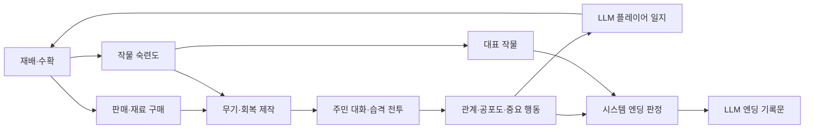

# 밭두렁난투 시스템·UI/UX 기획서 현재본

- 갱신일: 2026-08-03
- 기준 문서: `밭두렁난투_기획_결정로그_현재본.md`
- 저장소 최상위 AI 규칙: `AGENTS.md`
- 대상: 콘텐츠·레벨 기획자, UI/UX 기획자, HTML 프로토타입 구현 담당자와 작업 보조 AI

## 1. 이 문서의 역할

이 문서는 게임의 현재 구조를 빠르게 이해하기 위한 읽기 쉬운 설명서다. 정확한 규칙, 상태와 변경 이력의 단일 원본은 결정 로그다.

문서 사이에 표현 차이가 있으면 다음 우선순위를 사용한다.

1. `AGENTS.md`의 작업·승인·변경 안전 절차
2. 결정 로그의 폐기되지 않은 최신 DEC
3. 이 시스템·UI/UX 기획서
4. 콘텐츠 데이터 준비도 점검 문서

결정 로그에서 `확정`은 구현 제약, `보류`는 재검토 조건이 충족될 때 결정할 항목, `폐기`는 사용하지 않는 과거 결정이다. 콘텐츠 담당자와 AI는 보류 항목을 임의의 시스템 규칙으로 확정하면 안 된다.

## 2. 게임 한 줄 설명

플레이어는 낮에 무작위 작물을 재배하고 야생동물을 막으며, 정비 단계에서 수확물을 판매해 재료를 사고 무기와 회복 아이템을 제작한다. 습격일 밤에는 사연을 가진 주민과 대화·협상하거나 싸우고, 누적된 관계·공포도·작물 활용 기록으로 엔딩이 결정된다.

게임의 핵심 연결은 다음과 같다.

핵심 근거: `DEC-RUN-001`, `DEC-CRAFT-007`, `DEC-RESIDENT-046`, `DEC-CONTENT-011`, `DEC-JOURNAL-001`.

## 3. 런 구조

한 번의 런은 데이터로 정한 여러 일차로 구성한다. 전체 일수, 습격일, 마지막 습격, 일차별 야생동물 출현과 적대 주민은 코드에 고정하지 않는다.

기본 흐름은 다음과 같다.

1. 타이틀
2. 플레이어 이름 입력
3. 튜토리얼
4. 런 시작
5. 일차 시작
6. 재배 단계
7. 정비 단계
8. 습격이 없는 날은 밤 결과 후 다음 일차
9. 습격이 있는 날은 전투 전 대화
10. 대화 해결 또는 습격 전투
11. 필요한 경우 전투 중 투항 대화
12. 조우 결과
13. 마지막 습격이 아니면 다음 일차, 마지막 습격이면 엔딩

튜토리얼은 본 런과 시간·체력·자원을 공유하지 않는다. 재배 단계는 제한시간 종료로 끝나고, 정비 단계에는 시간제한이 없다. 플레이어 체력이 재배 또는 습격 중 0이 되면 즉시 전체 런에 실패한다.

당일 습격 여부는 그날 아침 공개한다. 전체 일정을 미리 보여주지 않으며 습격 예정 표시는 재배 HUD와 정비 화면에서 계속 확인할 수 있어야 한다.

일차 시작 연출에서는 전날의 확정 사실로 생성한 플레이어 1인칭 일지를 함께 표시한다. 1일차 아침에는 전날 기록이 없으므로 일지를 표시하지 않는다.

조우 결과와 밤 결과는 하루를 마무리하는 같은 층위의 화면이며, 습격이 있는 날과 없는 날에
둘 중 하나만 등장한다. 밤 결과는 그날의 실제 재배·조우 결과를 담지 않고 승인된 고정 문구만
표시한다.

핵심 근거: `DEC-RUN-003`, `DEC-RUN-008`, `DEC-RUN-009`, `DEC-RUN-014`, `DEC-RUN-015`, `DEC-JOURNAL-001`.

## 4. 기본 조작

| 행동 | 입력 |
|---|---|
| 이동 | `WASD` |
| 조준 | 마우스 커서 |
| 파종·수확 | `E` |
| 낫 공격 | 마우스 오른쪽 |
| 선택한 투척 무기 사용 | 마우스 왼쪽 |
| 투척 퀵슬롯 직접 선택 | `1~5` |
| 수량이 남은 투척 무기 순환 | 마우스 휠 |
| 현재 회복 아이템 사용 | `Q` 짧게 누르기 |
| 회복 퀵메뉴 열기·선택 | `Q` 길게 누른 채 마우스로 선택 후 놓기 |
| 일시정지 | `Esc` |

필수 대화와 투항 대화 중에는 필드 입력과 타이머를 정지한다. 대화 선택에는 시간제한이 없고 자유 입력을 사용하지 않는다.

핵심 근거: `DEC-INPUT-001~009`, `DEC-RESIDENT-030`, `DEC-RESIDENT-039`.

## 5. 자원과 보관함

| 자원 | 단일 저장 위치 | 주요 사용 |
|---|---|---|
| 돈 | 소지금 | 조합 재료 구매 |
| 수확물 | 수확물 보관함 | 판매, 제작, 생식, 주민 자원 협상 |
| 조합 재료 | 재료 보관함 | 제작 |
| 투척 무기 | 무기 보관함 | 재배·습격 전투 |
| 제작 회복 아이템 | 소모품 보관함 | 재배·습격 중 회복 |

공용 씨앗은 무제한이며 아이템 수량으로 관리하지 않는다. 퀵슬롯과 회복 파우치는 수량을 복사하는 보관함이 아니라 실제 보관함을 참조하는 접근 인터페이스다.

모든 보관함은 종류 수와 중첩 수량 제한이 없다. 자원은 일차와 단계가 바뀌어도 현재 런에서 유지되고 새 런 또는 런 실패 시 초기화한다.

핵심 근거: `DEC-RESOURCE-001~005`, `DEC-RESOURCE-014~018`.

## 6. 재배와 야생동물

빈 경작지에서 `E`를 누르면 공용 씨앗을 심는다. 작물 종류는 파종 순간 승인 작물의 `spawn_weight`에 따라 결정하지만 씨앗 단계에서는 공개하지 않는다.

작물 상태는 다음 세 단계다.

1. 씨앗
2. 성장 중
3. 수확 가능

작물은 재배 단계에서만 성장한다. 재배 단계가 끝나도 작물과 남은 성장 시간을 유지한다. 수확 시 `base_yield`만큼 수확물 보관함에 들어가고 경작지는 빈 상태가 된다.

야생동물은 재배 단계에 출현한다. `crop_first`는 수확 가능 작물을 우선 노리고, `player_only`는 플레이어만 노린다. 씨앗과 성장 중 작물은 공격하지 않는다. 재배 단계 종료 시 살아 있는 야생동물과 적용 효과를 제거한다.

핵심 근거: `DEC-FARM-001~006`, `DEC-FARM-010`, `DEC-CONTENT-003`, `DEC-CONTENT-007`.

## 7. 정비·거래·제작

정비 단계에서는 판매, 구매, 제작과 투척 퀵슬롯 편성을 원하는 순서로 이용한다.

### 거래

- 판매 가능: 수확물
- 구매 가능: 조합 재료
- 상점 재료 재고: 무제한
- 장바구니 없음
- 한 종류와 수량을 지정하고 `판매` 또는 `구매` 버튼으로 즉시 거래
- 자원 차감과 획득은 원자적으로 처리

거래 UI에는 단가, 수량, 총액, 거래 후 소지금 또는 보유 수량을 표시한다. 실행 중에는 같은 버튼의 중복 입력을 막는다.

### 제작

모든 레시피는 승인 작물 한 종류 이상과 조합 재료 한 종류 이상을 요구한다. 제작 대기시간·성공 확률·실패·무작위 품질은 없다. 한 레시피와 제작 횟수를 지정하고 버튼을 누르면 모든 입력 차감과 결과 지급을 하나의 처리로 완료한다.

제작 결과는 투척 무기 또는 회복 아이템이다. 실제 소비한 작물 수량만큼 작물별 숙련도가 증가한다. 기본 레시피는 처음부터 공개하고 상위 레시피는 작물 숙련도로 해금한다.

핵심 근거: `DEC-RESOURCE-006~013`, `DEC-CRAFT-001~008`, `DEC-CONTENT-015`.

## 8. 플레이어 전투

낫은 마우스 오른쪽으로 사용한다. 투척 무기는 마우스 왼쪽으로 한 번에 하나를 발사하고 발사 성공 시 무기 보관함에서 한 개를 소비한다.

투척 무기는 재배·습격 단계에서 사용할 수 있다. `direct`는 처음 맞은 적 하나, `area`는 충돌 또는 최대 사거리 위치에서 범위 안의 적들에게 피해를 준다. 자해와 아군 오사는 없다.

작물 속성은 투척 무기의 전투 효과 계통을 결정한다. 프로토타입 효과는 다음 두 가지다.

- `damage_over_time`
- `movement_slow`

같은 효과는 중첩하지 않고 `effect_rank`가 높은 효과를 우선하며 같은 등급은 최근 효과로 교체·갱신한다.

회복은 생식 가능한 수확물과 제작 회복 아이템을 하나의 회복 파우치에서 사용한다. 사용 중에는 이동할 수 있지만 느려지고 공격할 수 없다. 피격 또는 단계·대화 전환 시 취소되며 완료 시에만 한 개를 소비하고 체력을 회복한다.

핵심 근거: `DEC-INPUT-004~009`, `DEC-CONTENT-005`, `DEC-CONTENT-006`, `DEC-CONTENT-012`, `DEC-CONTENT-013`.

## 9. 주민 데이터와 사연

주민 원본은 고정 성격·말투, 전투 성향, 협상 성향과 전투·지원·성격 프로필 참조를 가진다. 사연 시나리오는 주민 원본의 목록 셀에 저장하지 않고 각 시나리오가 `resident_id` 하나를 참조한다.

프로토타입에서는 주민마다 승인 사연 시나리오를 하나만 사용한다. 사연은 다음 정보로 나눈다.

- `basic`: 전투 전 시작 대사에서 공개
- `core`: 공감 반응 또는 투항 시작 대사에서 공개

`source_fact_text`는 콘텐츠 제작 AI가 대사를 쓰는 승인된 사실 원본이다. 플레이어와 엔딩 LLM에는 직접 노출하지 않는다. `ending_fact_text`는 플레이어가 실제 확인한 정보만 엔딩 입력으로 전달한다.

주민 사연·대사·선택지·반응은 콘텐츠 제작 단계에서 AI 초안을 만들 수 있지만 사람이 승인한 고정 데이터만 게임에서 사용한다. 런타임 LLM은 주민 콘텐츠를 만들거나 판정하지 않는다.

핵심 근거: `DEC-RESIDENT-054`, `DEC-RESIDENT-022~026`, `DEC-RESIDENT-051`, `DEC-CONTENT-008`, `DEC-CONTENT-017`.

## 10. 전투 전 대화와 자원 협상

전투 전 대화는 시작 대사 후 선택지 세 개를 제공한다.

| 기능 | 역할 |
|---|---|
| 공감·설득 | 말로 물러나게 하거나 전투 상태를 결정 |
| 자원 협상 | 수확물 총개수를 대가로 전투 회피 시도 |
| 위협·대립 | 강경하게 대응하고 전투 진입 |

선택 결과는 선택지 문장이나 LLM이 정하지 않는다. 현재 주민의 성격 프로필과 선택 기능을 조회해 `조우 해결`, `위축 전투`, `일반 전투`, `격앙 전투` 중 하나를 확정한다.

자원 협상 선택지는 특정 작물을 요구하지 않고 `resource_offer_quantity`만 가진다. 현재 수확물 총수량이 부족하면 선택할 수 없다. 수량이 충분해도 주민 성격상 거절할 수 있으며, 이때 수확물을 소비하지 않는다.

주민이 수락하면 보유한 수확물 개별 단위에서 제안 수량만큼 결정적으로 무작위 선택한다. 선택된 작물 전체 차감과 주민의 생존·중립·해결·거래 관계 변경을 원자적으로 처리한다.

핵심 근거: `DEC-RESIDENT-017`, `DEC-RESIDENT-049`, `DEC-RESIDENT-050`, `DEC-CONTENT-009`.

## 11. 주민 전투·투항·보상

적대 주민은 `melee_chase` 또는 `ranged_chase` 패턴을 사용한다. 주민 공격에는 공격 전 바닥 예고나 조준선을 사용하지 않는다. 원거리 주민의 `projectile_max_range`는 `attack_range` 이상이어야 한다.

전투 중 주민 체력이 0이면 즉시 처치한다. 체력이 1 이상이고 투항 기준 이하로 처음 내려가면 전투를 멈추고 투항 대화를 시작한다.

투항 대화의 선택지는 다음 세 개다.

- 투항 수용·영입
- 대가 요구·퇴각
- 투항 거부·전투 계속

영입 주민은 이후 실제 습격 전투에서 한 명씩 지원할 수 있다. 퇴각과 처치 보상은 보상 묶음으로 정의하며 자원 지급과 주민 상태 변경을 원자적으로 처리한다.

주민 조우의 최종 결과 키는 다음 다섯 개다.

- `empathy_resolve`
- `resource_negotiation_resolve`
- `recruited`
- `retreated`
- `killed`

핵심 근거: `DEC-RESIDENT-016`, `DEC-RESIDENT-019~021`, `DEC-RESIDENT-039~043`, `DEC-RESIDENT-052`, `DEC-CONTENT-008`, `DEC-CONTENT-010`.

## 12. 관계·공포도·엔딩

관계는 숫자 호감도가 아니라 상태다.

| 해결 방식 | 관계 |
|---|---|
| 공감·설득 해결 | 우호 |
| 자원 협상 해결 | 거래 |
| 투항 수용·영입 | 동료 |
| 대가 요구·퇴각 | 강압 |
| 주민 처치 | 단절 |

공포도는 전역 정수다. 위협은 적은 공포도, 퇴각 대가 요구는 중간 공포도, 처치는 높은 공포도를 추가한다. 제출 빌드에서는 수치를 직접 표시하지 않는다.

숨겨진 공포도는 매 일차 시작에 표시하는 LLM 플레이어 일지가 마을 사람들의 태도 변화라는 서사로 간접 전달한다. 일지 입력에는 공포도 수치가 아니라 구간과 전날 대비 변화 방향만 사용한다.

마지막 습격의 모든 상태 변경을 끝낸 뒤 공포도 구간과 추가 조건으로 엔딩을 선택한다. 각 공포도 구간에는 우선순위 0의 기본 엔딩이 정확히 하나 있고 조건부 특별 엔딩은 우선순위 1 이상을 사용한다.

대표 작물은 숙련도, 제작 소비 누적 수량, 총수확량, 작물 ID 순으로 결정한다. 시스템이 엔딩 ID·제목·결과·에셋을 먼저 확정한 뒤 LLM에는 확인한 사실만 전달한다.

LLM은 한국어 3~5문장, 800자 이하의 `record_text`만 작성한다. 실패 시 같은 입력으로 한 번 재시도하고 다시 실패하면 해당 엔딩의 `fallback_record_text`를 표시한다. LLM 실패는 게임 완료를 막지 않는다.

핵심 근거: `DEC-RESIDENT-012`, `DEC-RESIDENT-046~048`, `DEC-CONTENT-011`, `DEC-PIPELINE-012`, `DEC-JOURNAL-002`.

## 13. UI/UX 현재 상태

현재 확정된 UI 규칙은 다음 열두 영역이다.

### 전체 화면 목록과 이동 흐름

화면은 타이틀, 이름 입력, 튜토리얼, 일차 시작, 필드(재배 모드/습격 모드), 정비 허브(보관함·
상점·제작 패널 포함), 전투 전 대화, 투항 대화, 조우 결과, 밤 결과, 런 실패, 엔딩, 일시정지로
구성한다.

필드는 맵을 항상 표시하는 베이스 화면이며 재배·습격 두 모드로 동작한다. 정비 단계에 진입하면
셔터가 필드를 덮고 그 위에 정비 허브 UI를 배치하며, 재배 종료로 정비에 들어갈 때도 같은
셔터를 쓴다. 습격이 있는 날은 정비 종료 시 셔터가 걷히며 필드(습격 모드)가 드러나고 곧바로
전투 전 대화가 필드 위 오버레이로 열린다. 습격이 없는 날은 셔터를 걷지 않은 채 밤 결과
화면으로 전환한다.

전투 전 대화와 투항 대화는 필드 위 오버레이이며 필수 화면이라 `Esc`로 닫을 수 없다. 런 실패와
엔딩은 서로 다른 화면으로 분리해 구현하고 공유 템플릿으로 묶지 않는다. 그 밖의 화면에서는
`Esc`로 언제든 일시정지를 열 수 있다.

핵심 근거: `DEC-UI-014`.

### 일시정지와 포커스 이탈

일시정지는 독립 화면이 아니라 필드 위 오버레이이며 항상 가장 위에 온다. 열려 있는 동안에도
아래의 필드와 다른 오버레이를 계속 표시하고, 배경을 어둡게 덮어 조작 대상이 아님을 나타낸다.

`Esc`로 닫을 수 있는 오버레이는 회복 퀵메뉴뿐이다. 정비 허브·전투 전 대화·투항 대화는
`Esc`로 닫히지 않고 그 위에 일시정지만 겹친다. 정비 허브는 하단 진행 버튼으로만 종료한다.
일시정지가 떠 있을 때 `Esc`를 다시 누르면 일시정지만 닫는다.

브라우저 탭 전환과 창 포커스 상실은 모두 포커스 이탈로 처리해 필드 시뮬레이션을 정지하고
일시정지 화면을 연다. 포커스가 돌아와도 자동 재개하지 않으며 카운트다운도 쓰지 않는다.
플레이어가 직접 재개한다. 일시정지 화면 안에 무엇을 배치할지는 `DEC-UI-027`에서 정한다.

핵심 근거: `DEC-UI-022`.

### 필드 공통 HUD

재배·습격 모드 공통으로 체력(게이지+수치), 현재 일차, 투척 퀵슬롯 5칸, 선택된 회복
아이템과 사용 게이지(취소 힌트 포함, `DEC-INPUT-012`), 일시정지·설정 아이콘을 표시한다.
재배 모드에서는 남은 재배 시간, 습격 예고(습격 없는 날에도 다른 문구로 상시 노출), 상호작용
안내를 추가로 표시한다. 소지금은 필드가 아닌 정비 단계에서만 표시한다.

핵심 근거: `DEC-UI-017`.

### 재배 화면과 상호작용 피드백

경작지는 빈 상태·씨앗·성장 중·수확 가능 네 상태를 외형으로 구분한다. 공용 씨앗이 무제한이라
빈 경작지는 항상 파종할 수 있으므로 파종 불가 상태를 따로 표시하지 않는다.

지금 `E`를 누르면 대상이 될 경작지 하나를 입력 전에 강조하고, 그 옆에 파종인지 수확인지를
함께 안내한다. 상호작용 반경은 상시 도형으로 그리지 않고 대상 강조가 그 역할을 대신한다.
수확이 성립하면 획득한 작물과 수량을 그 자리에 짧게 표시한다.

수확 가능이 된 경작지에는 표식을 계속 표시하고, 전환되는 순간 한 번만 강조한다. 전체 밭이
한 화면에 보이므로 화면 밖 작물 알림과 미니맵은 쓰지 않는다.

야생동물은 공격 예고와 작물을 먹는 진행 상태를 표시하되 목표선은 그리지 않는다. 적대 주민이
공격 예고를 쓰지 않는 것(`DEC-CONTENT-008`)과 대비되며, 도입 여부는 `DEC-CONTENT-020`에서
QA 후 재검토한다. 남은 재배 시간이 임박하면 시간 표시를 강조하고, 단계가 끝나면 별도 확인
없이 셔터로 정비 허브에 진입한다.

핵심 근거: `DEC-UI-004`, `DEC-UI-018`.

### 로딩·데이터 오류·LLM 폴백

부팅 시 콘텐츠 데이터 로딩 표시, 필수 데이터 누락 시 데이터 오류 화면(`DEC-UI-014`
화면 목록에 추가되는 항목, 개발 빌드는 상세 원인·제출 빌드는 일반 문구)을 보여준다.
엔딩 기록문·일지 생성 중에는 해당 화면 안에서 대기 표시만 하고 재시도 여부는 노출하지
않으며, 폴백 텍스트도 정상 생성 텍스트와 시각적으로 구분하지 않는다. 어떤 경우에도 LLM
생성 실패가 게임 진행을 막지 않는다.

핵심 근거: `DEC-UI-024`.

### 투척 퀵슬롯

- 현재 슬롯을 명확히 강조
- 소진으로 자동 전환되면 새 무기 이름과 아이콘을 짧게 강조
- 전부 소진되면 `투척 무기 없음`
- 빈 상태에서 발사하면 빈 발사음과 짧은 안내

### 거래

- 보유 수량·단가·총액 표시
- 거래 후 소지금 또는 잔여 수량 미리 표시
- 실행 불가능 거래 비활성화
- 선택과 실행 버튼 분리
- 성공 후 소지금·보관함·제작 가능 상태 즉시 갱신

### 제작

목록은 투척 무기와 회복 아이템으로 나누고, 각 분류 안에서 해금된 레시피를 먼저 둔다. 같은
구간에서는 기본 → 상위 순이고 그래도 같으면 레시피 ID 오름차순을 쓴다. 레시피 데이터에 표시
순서 열을 두지 않는다.

제작 대상은 한 번에 한 레시피만 선택한다. 여러 레시피를 모아 한 번에 확정하는 화면은 만들지
않는다. 해금된 레시피는 결과물 이름·설명과 실제 수치, 1회당 입력과 수량, 각 입력의 현재 보유
수량, 1회당 결과 수량을 보여준다. 결과물 수치는 설명 문장이 아니라 승인 데이터에서 읽는다.

지정한 제작 횟수에 필요한 전체 입력과 전체 결과 수량을 실행 전에 보여주고, 현재 자원으로
가능한 최대 횟수도 표시한다. 입력이 부족하면 실행 버튼만 비활성화하고 무엇이 모자란지 따로
안내하지 않는다 — 필요 수량과 보유 수량이 이미 나란히 있다.

잠긴 레시피는 이름과 해금 조건, 진행도까지만 보여주고 입력과 결과 수치는 해금 후에 공개한다.
해금 조건은 대상 작물의 논리 에셋과 현재·필요 숙련도, 제작에 더 사용하라는 짧은 안내로
표시한다. 제작으로 상위 레시피가 해금되면 즉시 알린다.

핵심 근거: `DEC-UI-006`.

### 정비 허브와 보관함·퀵슬롯 편성

정비 허브는 셔터 위에 놓이며 **보관함을 상시 표시하는 영역**과 기능 버튼 영역으로 나뉜다.
버튼은 판매·구매·제작·투척 퀵슬롯 편성 넷이고, 누르면 팝업이 열린다. 팝업은 한 번에 하나만,
항상 같은 자리에 연다. 보관함이 옆에 계속 떠 있어 제작·거래 중에도 보유량을 바로 확인한다.

팝업은 정비 허브 내부 화면이라 `DEC-UI-022`가 말하는 오버레이 층이 아니다. 닫는 경로는
**팝업 안의 닫기 버튼 하나뿐**이고 바깥 클릭으로도 `Esc`로도 닫히지 않는다. `Esc`는 여기서도
일시정지를 연다. 허브 하단의 진행 버튼(`DEC-RUN-006`의 두 문구)으로 정비를 끝내며 별도
확인 창은 없다.

보관함은 수확물·재료·무기·소모품 네 분류를 구분해 보여주고 각 항목의 수량과 승인 데이터에서
읽은 수치를 함께 표시한다. 퀵슬롯 편성은 팝업에서 다섯 칸을 모두 보여주고, 슬롯을 고른 뒤
무기를 고르는 두 단계 클릭으로 편성한다. 끌어놓기는 쓰지 않는다. 이미 편성된 무기는 선택할
수 없고, 수량이 0인 무기가 편성된 칸은 편성을 유지한 채 사용 불가로 구분한다. 슬롯에서 빼도
보관함 수량은 줄지 않는다.

핵심 근거: `DEC-UI-020`, `DEC-UI-021`.

### 습격 예고

`raid_type`의 세 값에 각각 대응하는 세 종류를 쓴다. **마지막 습격인 날은 일반 습격일과
구분해 알린다.** 일차 시작 연출에는 문장 형태를, 재배 HUD와 정비 허브에는 짧은 표지 형태를
쓰며 둘은 같은 정보를 길이만 달리 전달한다.

예고에 적대 주민의 이름과 전투·보상 정보를 넣지 않고 이후 일차의 습격 일정도 넣지 않는다.
세 종류는 시각적으로 구분하되 실제 색과 표현은 `DEC-ART-001`에서 정한다.

문구는 코드에 두지 않고 승인된 콘텐츠 데이터에서 공급하며, 담을 테이블의 구조는
`DEC-CONTENT-021`에서 정한다.

핵심 근거: `DEC-RUN-011`.

### 습격 전투 화면

공통 HUD에 적대 주민의 이름과 현재·최대 체력을 게이지와 수치로 더한다. **투항 기준선은
표시하지 않는다** — 보여주면 딱 그만큼만 때리는 계산이 되고 투항 대화가 사건이 아니게 된다.
습격 전투에는 시간제한이 없으므로 별도의 진행도 표시를 만들지 않고 남은 체력이 그 역할을
한다.

전투 전 대화의 판정 결과는 주민의 반응 대사로 전달하고 판정 이름이나 성공·실패 같은 시스템
용어를 따로 띄우지 않는다. 다만 **위축·격앙 상태는 습격 HUD에 조우가 끝날 때까지 표시**한다.
투항을 거부해 전투를 재개해도 보정이 유지되므로(`DEC-RESIDENT-037`) 그때 대사는 이미 지나가
있기 때문이다. 일반 상태는 표시하지 않고, 표시 이름은 `resident_combat_modifiers.csv`의
`display_name`을 화면에 노출해 쓴다. 실제 배율은 보여주지 않는다.

플레이어 피격은 즉시 알 수 있게, 적에게 명중한 순간과 적에게 걸린 전투 효과는 서로 구분해
표시한다. 조우가 해결되면 남은 투사체와 공격을 제거하고 확인 없이 조우 결과로 넘어간다.

지원 주민은 고정 위치에 적대 주민과 구분되게 두고 체력을 표시하지 않는다. 공격이 나가는
순간은 보여주되 다음 공격까지 남은 시간은 보여주지 않는다. 습격에 진입할 때 누가 지원하는지
알리고, 지원 기회를 소비했다는 사실은 조우 결과에서 전달한다.

핵심 근거: `DEC-UI-009`, `DEC-UI-019`, `DEC-UI-012`.

### 전투 전 대화와 투항 대화

시작 대사를 먼저 출력하고 선택지 세 개를 동시에 낸다. 대사는 순차 출력을 쓸 수 있고 진행 중
입력하면 즉시 전체가 뜬다. 시간제한이 없으므로 남은 시간을 표시하지 않는다.

**기능 이름(공감·자원 협상·위협)을 태그로 표시하지 않는다.** 세 기능은 시스템 판정에 쓰는
내부 역할이고(`DEC-RESIDENT-017`) 플레이어는 성격·사연에 맞게 쓰인 선택지 문장을 읽고 고른다.
세 선택지를 시각적으로 구분하되 그 구분이 기능 이름을 드러내지 않게 한다.

자원 협상 선택지에만 제안 수량과 현재 수확물 총수량, 무작위로 선택된 수확물이 소비된다는
사실을 한 줄로 짧게 붙인다. 대화 중에는 보관함이 보이지 않고 실제 소비될 작물을 미리 공개하지
않으므로(`DEC-RESIDENT-050`) 이 정보가 없으면 되돌릴 수 없는 손실이 예고 없이 일어난다.
총수량이 모자라면 선택지를 흐리게 처리해 고를 수 없음만 나타내고 별도 문구는 붙이지 않는다.

선택을 확정하면 반응 대사가 나오고 이전 선택으로 돌아갈 수 없다. 실제 소비된 작물은 조우
결과에서 전달한다.

투항 대화도 **같은 표시·입력 규칙**을 쓴다. 다만 투항 선택지에는 수량 조건이 없어 고를 수
없는 선택지가 생기지 않는다.

적대 주민이 열세에 도달하면 **예고 없이** 투항 대화로 전환한다. 투항 기준값도, 남은 체력과의
비율도 보여주지 않는다. 대화가 열려 있는 동안 배경 필드를 정지 상태로 구분하고 지원 주민의
공격 표시도 함께 멈춘다.

**이 대화가 마지막 투항 기회라는 사실을 알리지 않고, 거부 후 재개할 때 별도 알림도 두지
않는다.** 앞엣것은 플레이어 캐릭터가 알 수 없는 정보이고, 뒤엣것은 플레이어가 방금 직접
거부를 눌러 이미 준비된 상태이기 때문이다.

핵심 근거: `DEC-UI-007`, `DEC-UI-008`, `DEC-UI-010`.

그 밖의 세부 배치, 회복 퀵메뉴, 대화·투항·결과·엔딩 화면의 세부 표현,
접근성·오디오 UI는 `DEC-UI-001`, `DEC-UI-003`, `DEC-UI-011`, `DEC-UI-013`, `DEC-UI-015~016`, `DEC-UI-023`,
`DEC-UI-025~028`의 재검토 조건에 따라 후속 UI/UX 기획에서 확정한다. 콘텐츠 CSV에 임의의
화면 좌표·정렬·연출 값을 넣지 않는다.

## 14. 콘텐츠 데이터 구조

사람과 AI가 편집하는 원본은 UTF-8 CSV를 사용한다. 독립 콘텐츠의 공통 필드는 다음과 같다.

- `id`
- `kind`
- `content_status`
- `content_version`
- `display_name`
- `design_intent`

런타임 JSON은 `approved` 데이터로만 생성하며 자동 생성 결과를 직접 수정하지 않는다. 연결 CSV는 독립 버전을 갖지 않고 지정된 부모 콘텐츠의 승인과 버전에 귀속한다.

이름이 확정된 CSV의 목록은 `schema/tables/`를 단일 원본으로 한다 (`DEC-PIPELINE-020`). 실제 작성 순서와 단계별 AI 작업 방식은 `밭두렁난투_콘텐츠_데이터_준비도_점검.md`를 따른다.

고정 버전 원본은 `schema_manifest.json`, 엔딩 시스템 프롬프트 원본은 `ending_prompt_system.md`, 플레이어 일지 시스템 프롬프트 원본은 `journal_prompt_system.md`다. 실제 폴더 구조와 검증·생성 명령은 `DEC-PIPELINE-003`에서 확정했다.

핵심 근거: `DEC-PIPELINE-002`, `DEC-PIPELINE-004`, `DEC-PIPELINE-007~014`, `DEC-CONTENT-001`, `DEC-CONTENT-019`, `DEC-JOURNAL-004`.

## 15. 콘텐츠·레벨 담당자가 결정할 값

다음은 구조가 아니라 실제 콘텐츠·밸런스 작업이다.

- 전체 일수와 일차별 습격·야생동물 구성
- 작물 목록, 가중치, 성장 시간, 수확량, 가격과 생식 수치
- 작물 속성 문구와 효과 계통
- 재료 목록과 가격
- 무기·회복 아이템 수치
- 레시피 입력·결과와 숙련도 해금 기준
- 야생동물 수치와 출현 프로필
- 주민·성격·사연·대사·선택 반응
- 주민 전투·지원 수치와 투항 비율
- 보상 묶음
- 공포도 증가량·구간과 실제 엔딩
- 맵 크기, 시작점, 출현점과 경작지 좌표

콘텐츠 담당자는 시스템 필드와 허용 열거형을 바꾸지 않고 승인된 구조 안에서 값을 작성한다. 구조 변경이 필요하면 CSV에 임의 열을 추가하기 전에 관련 DEC의 변경 영향을 먼저 검토한다.

## 16. 구현 불변 원칙

1. 변경 가능한 게임 데이터는 코드에 절대 하드코딩하지 않는다. 승인 데이터가 단일 원본이며, 필수 데이터 누락을 코드 기본값으로 숨기지 않는다.
2. 승인 CSV에서 런타임 JSON을 생성하고 런타임 JSON은 직접 수정하지 않는다.
3. 아이템 수량과 주민 상태는 단일 원본만 가진다.
4. 거래·제작·협상·보상은 일부만 반영되지 않게 원자적으로 처리한다.
5. LLM은 엔딩 기록문과 확정된 플레이어 일지 외의 텍스트를 생성하지 않으며, 어떤 경우에도 판정과 상태 변경에 관여하지 않는다.
6. 확인하지 않은 사연과 숨겨진 원본은 엔딩 LLM과 일지 LLM에 전달하지 않는다.
7. 새 효과 키·결과 키·`kind`·필드 추가는 콘텐츠 값 추가가 아니라 스키마·구현 변경이다.
8. 확정 DEC와 충돌하는 구현 편의상 예외를 임의로 만들지 않는다.

코드는 게임 상태 전환, 판정 알고리즘, 원자적 처리와 데이터 검증처럼 데이터를 해석하고 실행하는 시스템 로직을 담당한다. 작물·아이템·가격·확률·시간·일정·좌표·주민·대사·보상·엔딩·밸런스 수치는 승인 데이터에서 공급한다. 프로토타입 임시값도 코드가 아니라 별도의 초안 또는 테스트용 데이터 파일에 둔다. 근거: `DEC-PIPELINE-016`.

## 17. 시스템 규칙 문제를 발견했을 때

콘텐츠·레벨 기획자나 구현 AI가 현재 규칙의 불일치, 모호함, 누락, 구현 곤란 또는 콘텐츠 충돌을 발견하면 임의의 CSV 열이나 코드 예외로 우회하지 않는다.

1. 현재 콘텐츠 생성·승인 또는 구현 변경을 멈춘다.
2. 관련 DEC와 실제 사례, 영향받는 시스템·UI/UX·데이터·스키마·코드·에셋을 확인한다.
3. 변경하지 않을 때의 결과와 가능한 대안, 추천안을 기획 책임자에게 제시한다.
4. 기획 책임자가 명시적으로 확정한 뒤에만 결정 로그의 확정·보류·폐기 절차를 수행한다.
5. 작업용·공개용 결정 로그를 동기화하고 `document-impact-map.csv`에 따라 이 문서와 콘텐츠 가이드의 영향 구간만 수정한다.
6. 파생 문서 전체에는 자동 구조·참조·사본 검수만 수행하고, 전체 의미 검수는 구조 변경과 지정된 마일스톤에서 수행한다.
7. 영향을 받은 승인 콘텐츠와 스키마를 재검토한 뒤 중단한 작업을 재개한다.

세부 진행 형식과 복사해 쓸 수 있는 프롬프트는 `밭두렁난투_콘텐츠_데이터_준비도_점검.md`를 따른다. 근거: `DEC-PIPELINE-018`, `DEC-PIPELINE-017`.
